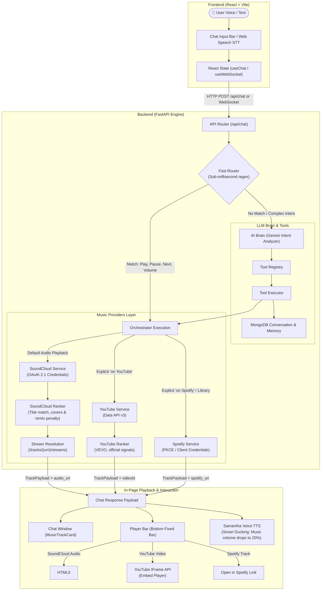

# 🎵 Zana AI — Complete Project Workflow & Architecture

**Zana AI** is an intelligent, voice-first AI music assistant and unified web player. It lets users speak or type natural language music requests (e.g., *"Play Pattuma"*, *"Put on some relaxing music"*, *"Search Spotify for Taylor Swift"*), intelligently routes and ranks tracks, and streams audio directly inside the web browser without external redirects.

---

## 1. High-Level End-to-End Workflow Diagram

---

## 2. Step-by-Step Execution Lifecycle

### Step 1: User Input & Voice Capture
- **Text**: User types into the input bar in `frontend/src/components/ChatWindow.tsx`.
- **Voice**: User clicks the microphone icon. `frontend/src/hooks/useSpeechRecognition.ts` activates the browser's SpeechRecognition API, transcribing speech in real-time.

---

### Step 2: Command Routing (Fast Router vs. AI Brain)
When the request reaches `backend/app/assistant/orchestrator.py`:

1. **Tier 1: Fast Command Router** (`backend/app/assistant/fast_router.py`):
   - Runs deterministic, zero-latency regex matching (< 1ms).
   - Handles playback controls (`play`, `pause`, `resume`, `next`, `previous`, `volume up/down`), status checks, and common queries like *"Play Pattuma"*.
2. **Tier 2: AI Brain (LLM Orchestration)**:
   - If the fast router does not match, the query is passed to `backend/app/assistant/brain/intent_analyzer.py`.
   - Powered by Gemini, it determines intent (e.g., `music_play`, `music_search`, `reminder_create`, `profile_update`, `general_chat`) and executes registered tools via `backend/app/assistant/brain/tool_executor.py`.

---

### Step 3: Music Resolution & Deterministic Ranking

| Provider | Trigger Condition | How It Resolves | Playback Method |
| :--- | :--- | :--- | :--- |
| **SoundCloud** *(Default audio provider)* | *"Play Pattuma"*, *"Play Believer"*, *"Listen to Arijit Singh"* | `soundcloud_service.py` searches `/tracks`, scores with `soundcloud_ranker.py`, and resolves direct audio stream (`hls_mp3_128_url` / `preview_mp3_128_url`). | In-page HTML5 `<audio>` element (video frame remains hidden). |
| **YouTube** | *"Play Believer on YouTube"*, *"Watch song on YouTube"* | `youtube_service.py` searches YouTube Data API v3 and ranks with `youtube_ranker.py`. | Official YouTube IFrame Player (with expand/collapse video docked viewer). |
| **Spotify** | *"Search Spotify for..."*, *"Play on Spotify"* | `spotify_service.py` searches Spotify Web API. | Shows interactive Spotify Card with metadata and **Open in Spotify** action. |

#### 🎯 Deterministic Ranking Logic:
To ensure the best version is picked:
- **Boosts**: Exact title match (+120), artist/creator match (+80), verified official creator tag (+35), duration suitability (+20).
- **Penalties**: Covers (-40), remixes (-40), karaoke (-50), instrumentals (-50), live bootlegs (-30), lofi (-35), and reaction/tutorial junk (-80).

---

### Step 4: Webpage Playback & User Experience

1. **Track Rendering**:
   - The chat displays a `MusicTrackCard.tsx` with artwork, title, creator attribution, provider badge, duration, and an in-page **Play** button.
2. **Bottom Player Bar** (`PlayerBar.tsx`):
   - Loads the audio directly into `<audio ref={audioRef}>`.
   - Real-time seek bar, duration tracking, volume slider, equalizer animation, and next/prev controls.
   - Mutual locking: If YouTube was playing, it pauses YouTube before starting SoundCloud audio, avoiding overlapping sound.
3. **Voice Response & Smart Audio Ducking**:
   - Assistant speaks the confirmation (*"Playing Pattuma on SoundCloud"*).
   - `useSpeechSynthesis.ts` alerts `PlayerBar.tsx`: while assistant is speaking, player volume automatically drops to **20%**, then smoothly restores.
4. **Attribution & Compliance**:
   - Includes official branding (7-bar Cloudmark logo for SoundCloud, YouTube icon, Spotify badge).
   - Provides a secondary external link (*"Open on SoundCloud"*) opening in a new tab without interrupting in-page playback.

---

### Step 5: Data Persistence & Context
- **MongoDB Atlas** (`mongo_service.py`):
  - Stores chat history, search queries, user profile preferences, and reminders.
- **Short-Term Context Memory** (`memory_service.py`):
  - Keeps track of what song is currently playing for contextual follow-ups (e.g., *"What song is this?"*, *"Who sang this?"*).

---

## 3. Developer & Operational Workflow

### Quick Commands Cheat Sheet

| Action | Command | Directory |
| :--- | :--- | :--- |
| **Run Backend Server** | `python -m uvicorn app.main:app --reload --port 8000` | `backend/` |
| **Run Frontend Server** | `npm run dev` (runs at `http://localhost:5173`) | `frontend/` |
| **Run Backend Tests** | `python -m pytest` (93 tests passing) | `backend/` |
| **Build Frontend** | `npm run build` | `frontend/` |
| **Lint Frontend** | `npm run lint` | `frontend/` |
